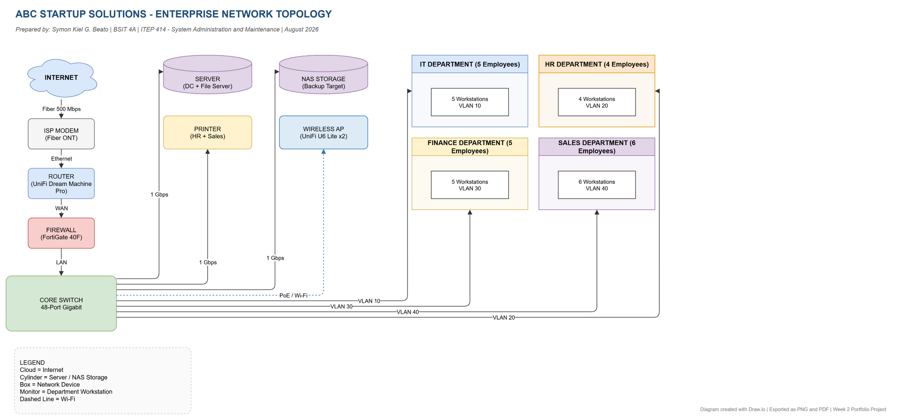

# Week 2 Portfolio Project: Enterprise Infrastructure Planning for a Startup Company

**Course:** ITEP 414 - System Administration and Maintenance
**Student:** Symon Kiel G. Beato
**Instructor:** John Randolf M. Penaredondo, MIT

[Full Report (Word)](EnterpriseInfrastructurePlan.docx) | [Network Diagram PNG](diagrams/NetworkDiagram.png) | [Network Diagram PDF](diagrams/NetworkDiagram.pdf) | [Diagram Source](diagrams/NetworkDiagram.drawio)

## Project Overview

Every successful IT infrastructure begins with proper planning. In this project, I acted as the Junior System Administrator of **ABC Startup Solutions**, a newly established software development company with 20 employees. My task was to prepare a complete IT infrastructure plan for the company before any equipment is purchased: hardware and software inventories, a network inventory, a network topology diagram, infrastructure recommendations, and a reflection.

## Learning Objectives

- Explain the roles and responsibilities of a System Administrator.
- Identify the hardware, software, and networking requirements of a small business.
- Analyze organizational IT requirements and prepare professional IT inventories.
- Design an enterprise network topology.
- Create technical documentation using Markdown.

## Company Scenario

ABC Startup Solutions is a software development company with 20 employees distributed across four departments:

| Department | Employees |
|------------|-----------|
| Information Technology | 5 |
| Human Resources | 4 |
| Finance | 5 |
| Sales | 6 |
| **TOTAL** | **20** |

The company currently has no computers, no server, no network, no internet infrastructure, and no security policies. Everything must be designed from scratch.

## Hardware Inventory Summary

| Asset ID | Hardware | Quantity | Department | Purpose |
|----------|----------|----------|------------|---------|
| HW-001 | Desktop Computer | 12 | Finance, HR, IT | Daily office tasks and development |
| HW-002 | Laptop | 8 | Sales, IT | Mobile work and client visits |
| HW-003 | Server | 1 | IT (Server Room) | Domain controller and file server |
| HW-004 | Router | 2 | IT (Server Room) | Main router plus one spare |
| HW-005 | Network Switch | 3 | IT (Server Room) | One 48-port core, two 24-port floor switches |
| HW-006 | Printer | 2 | HR, Sales | Monochrome laser + color printer |
| HW-007 | UPS | 6 | Finance, IT | Power protection for critical units |
| HW-008 | Wireless Access Point | 2 | Office Floor | Wi-Fi coverage |
| HW-009 | NAS Storage | 1 | IT (Server Room) | Central file storage and backups |
| HW-010 | External Backup Drive | 1 | IT (Server Room) | Offline backup (3-2-1 rule) |
| HW-011 | Monitor | 8 | Finance, IT | Dual monitor setups |

## Software Inventory Summary

| Software | Version | License | Purpose |
|----------|---------|---------|---------|
| Windows 11 Pro | 24H2 | OEM | Operating system for workstations |
| Ubuntu Server | 24.04 LTS | Open Source | Internal servers and web services |
| Microsoft 365 Apps | Latest | Subscription | Office documents and email |
| Visual Studio Code | 1.105 | Free | Code editor |
| Git | 2.48 | Open Source | Version control |
| GitHub Desktop | 3.4 | Free | Git interface |
| VirtualBox | 7.1 | Open Source | Virtual machines for testing |
| Google Chrome | 140 | Freeware | Web browser |
| Microsoft Defender | Built-in | Included | Antivirus baseline |
| AnyDesk | 9.1 | Freemium | Remote support |
| 7-Zip | 24.09 | Open Source | File compression |

## Network Diagram

The topology follows the flow: Internet -> ISP Modem -> Router -> Firewall -> Core Switch -> Server, NAS, Printer, Wireless Access Point, and the four departments (VLAN 10 to 40). The diagram was designed in Draw.io and exported as PNG and PDF.

## Technologies Used

- Markdown and GitHub for documentation
- Draw.io for network diagramming
- Microsoft Word for the portfolio report
- Concepts: TCP/IP, VLANs, DHCP, RAID, 3-2-1 backup strategy

## Challenges Encountered

- **Hardware inventory justification:** Every quantity had to be backed by a real reason, which forced me to think from the perspective of each department instead of just listing items.
- **Network diagram design:** Tracing the data flow from the internet down to each department and assigning VLANs was tricky at first.
- **Keeping documentation professional:** Making the report readable and organized while covering all requirements took several revisions.

## Reflection

The project taught me that infrastructure planning starts with understanding the business, not with buying equipment. I learned that inventories are decision documents, that planning is cheaper than fixing mistakes, and that documentation is a tool for the next person who will manage the network. See the full 410-word reflection in the portfolio report.

## References

- CompTIA A+ Certification: https://www.comptia.org/certifications/a
- CompTIA Network+ Certification: https://www.comptia.org/certifications/network
- Cisco CCNA Certification: https://www.cisco.com/site/us/en/learn/training-certifications/certifications/enterprise/ccna/index.html
- Red Hat RHCSA Certification: https://www.redhat.com/en/services/training/rhcsa-red-hat-certified-system-administrator
- AWS SysOps Administrator Certification: https://aws.amazon.com/certification/certified-sysops-admin-associate/
- Microsoft Azure Administrator Certification: https://learn.microsoft.com/en-us/credentials/certifications/azure-administrator/
- LPIC-1 Certification: https://www.lpi.org/our-certifications/lpic-1-overview/
- Microsoft Defender Antivirus Documentation: https://learn.microsoft.com/en-us/windows/security/operating-system-security/virus-and-threat-protection/microsoft-defender-antivirus
