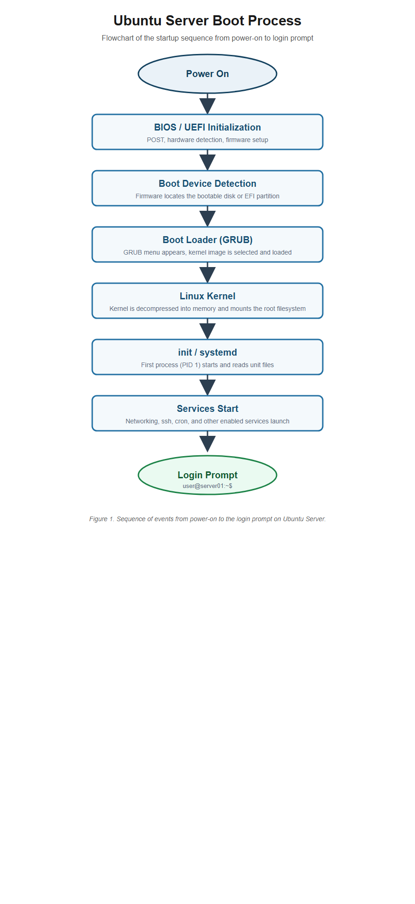

# Week 3 Portfolio Project: Enterprise Server Deployment and Operating System Installation

**Course:** ITEP 414 - System Administration and Maintenance
**Student:** Symon Kiel G. Beato
**Instructor:** John Randolf M. Penaredondo, MIT

[Installation Guide](InstallationGuide.pdf) | [Professional Installation Manual](ProfessionalInstallationManual.pdf) | [BIOS vs UEFI](BIOS_vs_UEFI.pdf) | [Boot Process Flowchart PDF](BootProcessFlowchart.pdf) | [Flowchart PNG](diagrams/BootProcessFlowchart.png) | [Flowchart Source](diagrams/BootProcessFlowchart.drawio)

## Project Overview

Operating systems serve as the foundation of every enterprise IT infrastructure. In this project, I acted as the Junior System Administrator of **ABC Startup Solutions**, a startup company deploying its first Linux server. I performed a complete **Ubuntu Server 26.04 LTS** installation inside Oracle VirtualBox, configured the essential server settings, verified the installation, compared modern boot technologies, and documented every step so that a future administrator can reproduce the deployment. The server will later be used for file sharing, remote administration, database hosting, web hosting, and internal services.

## Learning Objectives

- Explain the purpose of an operating system in enterprise environments.
- Differentiate BIOS and UEFI firmware.
- Explain the stages of the computer boot process.
- Compare Ubuntu Server, Windows Server, and Rocky Linux.
- Install and configure Ubuntu Server in a virtual machine.
- Enable secure remote administration using SSH.
- Produce professional technical documentation.

## Virtual Machine Specifications

| Component | Configuration |
|-----------|---------------|
| Name | Ubuntu-Server-Week03 |
| Type / Version | Linux, Ubuntu (64-bit) |
| RAM | 4096 MB (4 GB) |
| CPU | 2 virtual processors |
| Storage | 40 GB (VDI) |
| Network | NAT |
| Optical Drive | ubuntu-26.04-live-server-amd64.iso (removed after install) |

## Installation Summary

- Downloaded the Ubuntu Server 26.04 LTS ISO and Oracle VirtualBox.
- Created the virtual machine with the specifications above and attached the ISO.
- Ran the installer with these settings: language **English**, keyboard **English (US)**, network **DHCP** (assigned 10.0.2.15), hostname **server01**, user **beato**, disk **Guided, use entire disk**, and **no extra packages**.
- Rebooted after installation and removed the installation medium from the optical drive.

## Configuration Summary

| Setting | Value |
|---------|-------|
| Hostname | server01 |
| User account | beato (administrative, sudo) |
| IP address (DHCP) | 10.0.2.15 |
| Partition scheme | Guided, entire disk (LVM, ext4) |
| SSH service | openssh-server, active and enabled on port 22 |
| Package sources | archive.ubuntu.com (switched from ph.archive.ubuntu.com mirror) |

## Verification Results

All six verification tasks were completed with screenshots in the [screenshots](screenshots) folder:

| Task | Command | Result |
|------|---------|--------|
| Login | (account login) | Successful, welcome message shown |
| Hostname | `hostname` | server01 |
| IP address | `ip addr` | inet 10.0.2.15 on enp0s3 |
| Internet connectivity | `ping -c 4 google.com` | 0% packet loss |
| System update | `sudo apt update && sudo apt upgrade -y` | 51 packages upgraded |
| SSH service | `systemctl status ssh` | active (running), enabled |

## BIOS vs UEFI Highlights

- **BIOS** reads the Master Boot Record of a disk, supports only 2 TB disks and MBR partitions, has no security features, and initializes hardware one device at a time.
- **UEFI** loads .efi boot loaders from a GPT partition, supports virtually unlimited disk sizes, offers **Secure Boot** (it verifies boot loader signatures), and initializes hardware in parallel for faster booting.
- UEFI has replaced BIOS because of the 2 TB limit, the demand for Secure Boot protection, and because Microsoft required UEFI for Windows 8 certified hardware starting in 2012. Full comparison: [BIOS_vs_UEFI.pdf](BIOS_vs_UEFI.pdf)

## Boot Process Flowchart

The boot sequence runs in eight stages: **Power On -> BIOS/UEFI Initialization -> Boot Device Detection -> Boot Loader (GRUB) -> Linux Kernel -> init/systemd -> Services Start -> Login Prompt**. Editable source: [BootProcessFlowchart.drawio](diagrams/BootProcessFlowchart.drawio)

## Windows Server Installation (Bring-Home Activity)

Windows Server 2025 Standard Evaluation (Desktop Experience) was installed in a separate virtual machine to compare the installation experience with Ubuntu Server. Screenshots are in the [screenshots](screenshots) folder:

| Step | Screenshot |
|------|------------|
| Edition selection | `window server setup.png` (Windows Server 2025 Standard Evaluation, Desktop Experience) |
| Installation progress | `installing window server.png` |
| Version confirmation | `windows logged in.png` (Version 24H2, OS Build 26100.32230, 180-day evaluation) |

The evaluation edition requires no product key, expires in 180 days, and uses the Server Manager console for administration after login.

## Challenges Encountered

| Challenge | Solution |
|-----------|----------|
| OpenSSH server was not installed during installation | Installed manually with `sudo apt install openssh-server -y` and enabled with `sudo systemctl enable --now ssh` |
| `apt upgrade` failed with HTTP 403 Forbidden from ph.archive.ubuntu.com | Switched the repository URIs to archive.ubuntu.com in the ubuntu.sources file |
| Sources file became malformed after editing (URI error) | Corrected the two URI lines in nano and re-ran `sudo apt update` |
| Virtual machine window froze during the upgrade | Restarted the VM and repaired packages with `dpkg --configure -a` and `apt --fix-broken install` |
| Password was visible during the first login attempt | Changed it immediately with the `passwd` command |

## Reflection

This week's project was the most hands-on activity in the course so far, because it required me to go through an entire server deployment from scratch. I learned that installing an operating system is only a small part of the job of a system administrator. The real work begins after the installer finishes: verifying that the hostname, the network, and the services are correct, updating the system, and writing documentation that another person can follow.

The most valuable lesson came from the problems I hit. I discovered that the OpenSSH server had not been installed during the installation wizard, so I had to install it manually with apt and enable it with systemctl. Later, apt upgrade failed with a 403 Forbidden error coming from the Philippines mirror, ph.archive.ubuntu.com. At first I thought something was wrong with my system, but after reading the error carefully I realized the mirror itself was the problem. Switching the repository to archive.ubuntu.com fixed it permanently. I also learned the hard way that editing configuration files can break things if you are not careful: my sources file became malformed and apt could not read it until I corrected the URIs. These three problems taught me a troubleshooting workflow: read the error, check the simplest cause first, make one change at a time, and verify with the appropriate command.

Understanding firmware also helped me appreciate how a server actually starts. Before this project, I never thought about the difference between BIOS and UEFI. Now I understand why modern servers use UEFI: GPT supports disks larger than 2 TB, Secure Boot blocks unsigned boot loaders, and parallel initialization makes booting faster. The flowchart exercise forced me to order every step of the boot process correctly, which deepened my understanding of how the kernel and systemd take over from the firmware.

Finally, I learned that documentation is a deliverable, not an afterthought. Writing the installation guide and the manual made me realize that a good guide must record exact commands, expected outputs, and the problems that were solved, because the next administrator will not have my memory. This project gave me a solid foundation for the rest of the course, and I feel more confident about managing real servers because I have now deployed one from start to finish.

## References

- [Ubuntu Server Documentation](https://ubuntu.com/server/docs)
- [Ubuntu Installation Guide](https://help.ubuntu.com/community/Installation)
- [Oracle VirtualBox User Manual](https://www.virtualbox.org/manual)
- [Microsoft Evaluation Center: Windows Server 2025](https://www.microsoft.com/en-us/evalcenter/evaluate-windows-server-2025)
- [Rocky Linux Documentation](https://docs.rockylinux.org)
- Additional sources are listed in the [references](references) folder.
